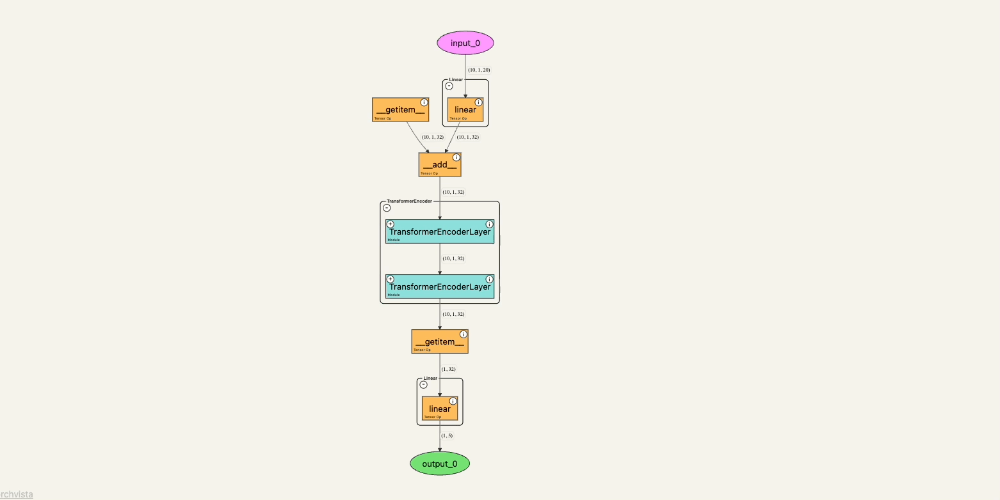
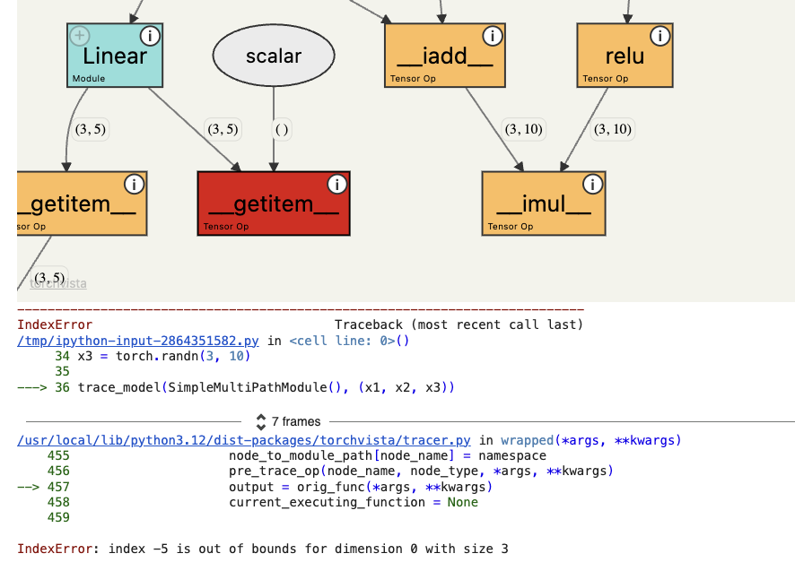
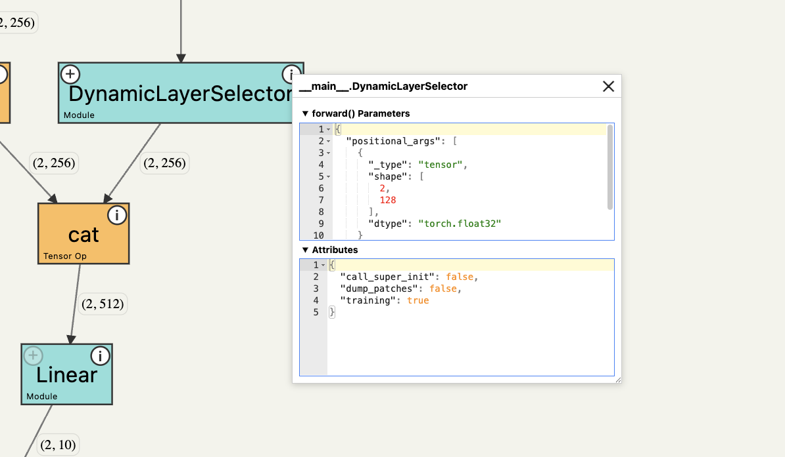

# torchvista

An interactive tool to visualize the forward pass of a PyTorch model directly in the notebook—with a single line of code. Works with web-based notebooks like Jupyter, Google Colab and Kaggle. Also allows you to export the visualization as image, svg and HTML.

## ✨ Features

### Interactive graph with drag and zoom support



--------

### Collapsible nodes for hierarchical modules 


--------

### Error-tolerant partial visualization when errors arise
(e.g., shape mismatches) for ease of debugging



--------

### Click on nodes to view parameter and attribute info



--------


## Demos

- Quick Google Colab tutorial 👉 [here](https://colab.research.google.com/drive/1wrWKhpvGiqHhE0Lb1HnFGeOcS4uBqGXw?usp=sharing) (must be logged in to Colab)
- Check out demos 👉 [here](https://sachinhosmani.github.io/torchvista/)

## ⚙️ Usage

Install via pip
```
pip install torchvista
```

(Alternatively, torchvista can also be installed via conda-forge. See [here](https://github.com/conda-forge/torchvista-feedstock?tab=readme-ov-file#installing-torchvista) for instructions)

Run from your **web-based notebook** (Jupyter, Colab, VSCode notebook, etc)

```
import torch
import torch.nn as nn

# Import torchvista
from torchvista import trace_model

# Define your module
class LinearModel(nn.Module):
    def __init__(self):
        super().__init__()
        self.linear = nn.Linear(10, 5)

    def forward(self, x):
        return self.linear(x)

# Instantiate the module and tensor input
model = LinearModel()
inputs = torch.randn(2, 10)

# Trace!
trace_model(model, inputs)
```
## API: `trace_model`

```python
trace_model(
    model,
    inputs,
    show_non_gradient_nodes=True,
    collapse_modules_after_depth=1,
    forced_module_tracing_depth=None,
    height=800,
    width=None,
    export_format=None,
    show_module_attr_names=False,
    export_path=None,
    show_compressed_view=False,
)
```

| Parameter | Type | Default Value | Category | Description |
| --- | --- | --- | --- | --- |
| `model` | `torch.nn.Module` | — | Tracing | Model instance to visualize. |
| `inputs` | `Any` | — | Tracing | Input(s) forwarded into the model; pass a single input or a tuple. |
| `show_non_gradient_nodes` | `bool` | `True` | Visual | Display nodes for constants and other values outside the gradient graph. |
| `collapse_modules_after_depth` | `int` | `1` | Visual | Depth to initially expand nested modules; `0` collapses everything (nodes can still be expanded interactively). |
| `forced_module_tracing_depth` | `int` | `None` | Tracing | Maximum depth of module internals to trace; `None` traces only user-defined modules. |
| `height` | `int` | `800` | Visual | Canvas height in pixels. |
| `width` | `int \| str` | `None` | Visual | Canvas width; accepts pixels or percentages; defaults to full available width when omitted. |
| `export_format` | `str` | `None` | Export | Optional export format: `png`, `svg`, or `html` if exporting graph as a file. Otherwise, by default the graph is shown within the notebook.|
| `show_module_attr_names` | `bool` | `False` | Visual | Display attribute names for modules when available instead of just class names. |
| `export_path` | `str` | `None` | Export | Custom path if exporting as a file. **Only HTML format** is currently supported with custom export paths. If only file name is specified, it will be created inside the present working directory. |
| `show_compressed_view` (Experimental; Unreleased) | `bool` | `False` | Visual | Compress the graph by showing repeating nodes of the same type with identical input and output dims in single "repeat" blocks. This feature currently only recognises repeating nodes with `Sequential` modules. |
